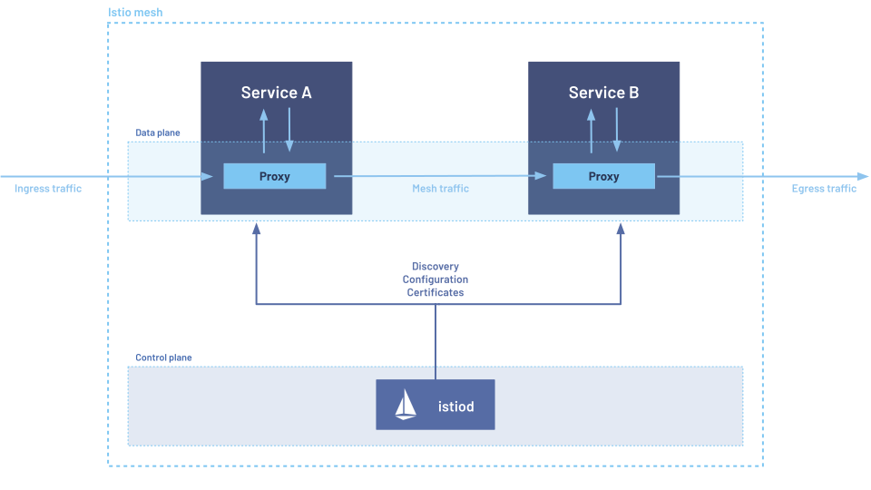

# 1) What is a **Service Mesh**?


A **service mesh** is an infrastructure layer that manages **service-to-service communication** for microservices. Instead of baking networking, security, and observability logic into each service, a mesh provides these features **uniformly and transparently** via **proxies** that sit next to your services.

**Core capabilities**

* **Traffic management:** intelligent L4/L7 routing, load-balancing, timeouts, retries, circuit breaking, fault injection.
* **Security:** mutual TLS (mTLS), service identity, authentication (e.g., JWT), authorization (fine-grained, policy-driven).
* **Observability:** uniform metrics, logs, and distributed tracing without code changes.
* **Policy enforcement:** rate limits, quotas, and guardrails for service calls.

**How it works (high level)**

* A **data plane** of lightweight proxies (typically Envoy) intercepts all in/out traffic for each service (sidecar pattern or ambient dataplane).
* A **control plane** configures the proxies, distributes certificates/identity, and centralizes policy.

---

# 2) What is **Istio**?


**Istio** is a popular, production-grade **service mesh** for Kubernetes (and beyond) that:

* Uses **Envoy** as its data plane proxy.
* Provides a single control plane component, **Istiod**, to push routing/security configs and issue **SPIFFE-based** identities (certs) for mTLS.
* Exposes Kubernetes-native **CRDs** (custom resources) to declare traffic, security, and telemetry policies.

---

# 3) **Why Istio?**

* **Standardization:** One place to implement retries, timeouts, TLS, authN/Z, and telemetry—**no app changes** required.
* **Safety:** Progressive delivery (canary, A/B, traffic shadowing), fault injection to test resilience, and circuit breakers.
* **Security by default:** mTLS everywhere, strong service identity, and zero-trust posture.
* **Deep visibility:** Uniform metrics/trace/logs; easy black-box troubleshooting.
* **Ecosystem:** Broad community, Kiali for topology, great docs, multi-cluster support, VM integration.

Trade-offs:

* Additional **complexity** and **resource overhead** (proxies).
* Requires learning Istio CRDs and troubleshooting Envoy behavior.

---

# 4) **Istio Components**

**Control Plane**

* **Istiod**

  * **Pilot** part: service discovery & config distribution to Envoy (xDS APIs).
  * **Security (Citadel) part:** issues, rotates, and revokes certificates; manages **SPIFFE IDs** like `spiffe://cluster.local/ns/<ns>/sa/<sa>`.
  * **Config validation:** validates & distributes Istio CRDs.

**Data Plane**

* **Envoy sidecar** per pod (in sidecar mode), or **ztunnel/waypoint** in ambient mode (see Advanced).
* **Ingress Gateway**: Envoy running at the edge to accept external traffic.
* **Egress Gateway**: controlled outbound path to the internet/externals; supports TLS origination and policy.

**Key CRDs**

* **Gateway** (or Kubernetes Gateway API): edge L7 entry.
* **VirtualService:** routing rules (hosts, matches, weights, timeouts, retries).
* **DestinationRule:** subsets (versions), load-balancing, connection pools, outlier detection, TLS to upstream.
* **ServiceEntry:** register external services (DNS/IP) so mesh can treat them like first-class endpoints.
* **WorkloadEntry / WorkloadGroup:** bring **VMs/bare-metal** workloads into the mesh.
* **PeerAuthentication / RequestAuthentication / AuthorizationPolicy:** mTLS/JWT/RBAC security.
* **Telemetry:** control which metrics/traces/logs are produced and where they go.
* **EnvoyFilter / WasmPlugin:** low-level or extensible customizations.

---

# 5) **Istio Architecture**



**Planes**

* **Data Plane**: Envoy proxies (sidecar or ambient dataplane components) intercept traffic and enforce policies.
* **Control Plane**: **Istiod** computes desired state and pushes it to proxies over **xDS**.

**Identity & Trust**

* Each workload (K8s ServiceAccount) gets a **SPIFFE identity**; Istiod acts as CA (or plugs to external CA).
* Certificates distributed via **SDS** (Secret Discovery Service), auto-rotated.

**Traffic Flow (sidecar mode)**

1. Client service → local Envoy sidecar → network → server’s Envoy sidecar → server.
2. Both sides authenticate via mTLS, apply routing/LB/timeouts/policies, and emit telemetry.

**Ambient Mesh (optional)**

* Moves L4 interception to node-level **ztunnel** (no sidecars).
* L7 policies executed by **waypoint** proxies, attached **per-service** or **per-namespace**.
* Lowers per-pod overhead; simplifies ops at scale.

---

# 6) **Traffic Management in Istio**

**Routing basics (VirtualService + DestinationRule)**

* **Match** on host, path, headers, methods, cookies, etc.
* **Route** to **subsets** (versions) defined in **DestinationRule** using labels (e.g., `version: v1`, `v2`).
* **Weights** shift traffic gradually (canary), or split by headers (A/B).

**Load Balancing (DestinationRule.spec.trafficPolicy.loadBalancer)**

* `ROUND_ROBIN` (default), `LEAST_REQUEST`, `RANDOM`, **consistent hash** (cookie/header/ip).
* **Connection pool** settings to cap concurrent connections/requests.
* **Outlier detection** (circuit breaking): eject unhealthy hosts based on error rates/5xx/RTT.

**Resilience**

* **Retries** (attempts, per-try timeout), **global timeouts**.
* **Fault injection** (delays/aborts) to test fallbacks.
* **Traffic mirroring** (shadowing) to new version without user impact.

**Edge & Egress**

* **Gateway** + **VirtualService** for TLS termination, SNI routing, HTTP routes, HTTP→HTTPS redirect.
* **Egress Gateway** + **ServiceEntry** to control outbound traffic & apply TLS origination.

**Example: Canary (90/10)**

```yaml
# subsets for v1/v2
apiVersion: networking.istio.io/v1beta1
kind: DestinationRule
metadata: { name: reviews }
spec:
  host: reviews.default.svc.cluster.local
  subsets:
    - name: v1
      labels: { version: v1 }
    - name: v2
      labels: { version: v2 }

---
apiVersion: networking.istio.io/v1beta1
kind: VirtualService
metadata: { name: reviews }
spec:
  hosts: [ "reviews" ]
  http:
    - route:
        - destination: { host: reviews, subset: v1 }
          weight: 90
        - destination: { host: reviews, subset: v2 }
          weight: 10
      timeout: 5s
      retries: { attempts: 2, perTryTimeout: 2s }
```

---

# 7) **Security**

**mTLS modes (PeerAuthentication)**

* `STRICT`: only mTLS traffic allowed.
* `PERMISSIVE`: allow both plaintext and mTLS (useful during migration).
* `DISABLE`: no mTLS.

```yaml
apiVersion: security.istio.io/v1
kind: PeerAuthentication
metadata: { name: default, namespace: default }
spec:
  mtls: { mode: STRICT }
```

**Request Authentication (JWT)**
Validate tokens at L7, optionally require on specific paths.

```yaml
apiVersion: security.istio.io/v1
kind: RequestAuthentication
metadata: { name: jwt, namespace: default }
spec:
  selector: { matchLabels: { app: api } }
  jwtRules:
    - issuer: "https://issuer.example.com"
      jwksUri: "https://issuer.example.com/.well-known/jwks.json"
```

**Authorization (RBAC)**
Allow/deny based on source identity, principals, namespaces, paths, methods, ports, or JWT claims.

```yaml
apiVersion: security.istio.io/v1
kind: AuthorizationPolicy
metadata: { name: api-allow, namespace: default }
spec:
  selector: { matchLabels: { app: api } }
  action: ALLOW
  rules:
    - from:
        - source:
            principals: [ "spiffe://cluster.local/ns/default/sa/frontend" ]
      to:
        - operation:
            methods: [ "GET", "POST" ]
            paths: [ "/v1/*" ]
```

**Best practices**

* Enforce `STRICT` mTLS mesh-wide, then add exceptions if needed.
* Prefer **service account per workload** for scoping identity.
* Keep **JWT validation at the edge** (Ingress) and **internal authZ** at services.

---

# 8) **Observability**

**Metrics**

* Envoy emits standard **request volume, success/error rates, latency buckets**, etc.
* Scraped by **Prometheus**; use **Grafana** dashboards and **Kiali** for topology & health.
* Control via `Telemetry` CRD (enable/disable metrics, exporters).

```yaml
apiVersion: telemetry.istio.io/v1
kind: Telemetry
metadata: { name: mesh-telemetry, namespace: istio-system }
spec:
  metrics:
    - providers: [ { name: prometheus } ]
      overrides:
        - match: { metric: REQUEST_COUNT }
          disabled: false
```

**Tracing**

* Propagates context headers (`traceparent`, `x-b3-*`, etc.).
* Export to **Jaeger/Zipkin/OTel**; configure sampling via `Telemetry` or `meshConfig`.

**Logging**

* Access logs from Envoy (enable globally or per workload); useful for L7 debugging.

**Kiali**

* Visualizes real-time traffic, error hotspots, version splits, and policy health.

---

# 9) **Advanced Concepts**

* **Ambient Mesh:** data plane without sidecars

  * **ztunnel** handles transparent L4, **waypoint** provides per-service L7.
  * Reduces per-pod overhead; gradual adoption.
* **Multi-cluster / multi-network:**

  * **Shared root of trust** and **east-west gateway**; supports failover and locality-aware routing.
* **Trust domains & federation:**

  * Map identities across clusters/meshes (e.g., `cluster.local` ↔ `prod.local`).
* **Egress TLS origination:**

  * Mesh terminates external TLS and re-establishes mTLS internally for policy/visibility.
* **Circuit breaking & outlier detection:**

  * Eject misbehaving endpoints automatically to protect callers.
* **WasmPlugin / EnvoyFilter:**

  * Extend Envoy at runtime (custom auth, transformations, telemetry enrichment). Use sparingly.
* **CNI Plugin:**

  * Removes need for NET\_ADMIN in sidecars; cleaner pod security context.
* **VM/Bare-metal onboarding:**

  * **WorkloadEntry/Group** bring non-K8s workloads under mesh policies/identity.

---

# 10) **Practical Use Case Scenarios**

1. **Canary Release with Guardrails**

* Subset v2 gets 1% → 10% → 50% → 100% while you watch error rate/latency in Kiali/Grafana.
* Use **outlierDetection** to auto-eject bad v2 pods; roll back by flipping weights.

2. **Blue/Green for API Gateway**

* Two gateway deployments (blue/green) front the same services; DNS or `Gateway` routes control cutover.
* Validate green with mirrored traffic before switch.

3. **A/B Testing by Header/JWT Claim**

* Route users with header `x-exp=on` or claim `plan=premium` to v2 (feature flagged) using `VirtualService` header matches.

4. **Zero-Trust Internal Calls**

* Enforce **STRICT mTLS** and **AuthorizationPolicy** so only specific callers (by SPIFFE ID or namespace) can hit sensitive services.
* Add **JWT** on the edge for user-level auth.

5. **Resilience for Unstable Upstream**

* Add **retry** with backoff, **timeout** of 2–5s, and **circuit breaker** (max requests, ejection).
* Use **fault injection** in staging to verify timeouts/fallbacks.

6. **Shadow (Mirroring) to New Version**

* Mirror 100% of traffic to v2 with no user impact; analyze latency and errors before any real cutover.

7. **Controlled Egress to SaaS**

* Define **ServiceEntry** + **EgressGateway**; perform **TLS origination** at the gateway, enforce allow-list domains, and log all egress.

8. **Multi-Cluster HA**

* Two clusters (same mesh) with **east-west gateways**; failover if local endpoints are unhealthy; prefer same-zone endpoints for latency.

9. **Onboard a Legacy VM**

* Register VM with **WorkloadEntry**; it receives a SPIFFE identity and participates in mTLS and RBAC like K8s pods.

10. **Tenant Isolation**

* Per-namespace **AuthorizationPolicy** and **waypoint** (ambient) to isolate tenants while keeping shared platform services accessible via explicit policies.

---

## Handy Commands & Ops Tips

**Install (demo profile)**

```bash
istioctl install --set profile=demo -y
```

**Label namespace for auto-injection (sidecar mode)**

```bash
kubectl label namespace myapp istio-injection=enabled
```

**Check proxy sync & health**

```bash
istioctl proxy-status
istioctl analyze
```

**Enable mTLS mesh-wide quickly**

```bash
kubectl apply -n istio-system -f - <<'EOF'
apiVersion: security.istio.io/v1
kind: PeerAuthentication
metadata: { name: default }
spec: { mtls: { mode: STRICT } }
EOF
```

**Circuit breaking example**

```yaml
apiVersion: networking.istio.io/v1beta1
kind: DestinationRule
metadata: { name: payments }
spec:
  host: payments.default.svc.cluster.local
  trafficPolicy:
    connectionPool:
      http:
        http1MaxPendingRequests: 100
        maxRequestsPerConnection: 100
    outlierDetection:
      consecutive5xxErrors: 5
      interval: 5s
      baseEjectionTime: 1m
      maxEjectionPercent: 50
```

**Traffic mirroring**

```yaml
apiVersion: networking.istio.io/v1beta1
kind: VirtualService
metadata: { name: checkout }
spec:
  hosts: [ "checkout" ]
  http:
    - route:
        - destination: { host: checkout, subset: v1 }
      mirror:
        host: checkout
        subset: v2
      mirrorPercentage: { value: 100.0 }
```

---

## Quick Checklist (production-minded)

* [ ] Enforce **STRICT mTLS** and set **peer/request auth** defaults.
* [ ] Define **timeouts/retries** explicitly (don’t rely on defaults).
* [ ] Use **outlier detection** and **connection pools** for stability.
* [ ] Centralize **ingress** via **Gateway**, validate TLS/SNI/HTTP→HTTPS.
* [ ] Observe with **Prometheus + Grafana + Kiali + tracing**; set sampling wisely.
* [ ] Keep CRDs under GitOps; use **`istioctl analyze`** in CI.
* [ ] Start with a **narrow scope** (single namespace/app), then expand.
* [ ] Consider **ambient** if sidecar ops/overhead are a concern.

---

# Istio Lab: Traffic Management and Observability

This lab will guide you through deploying a sample application in a Kubernetes cluster with Istio. You'll use Istio's core features to manage traffic and gain observability without changing any application code.

***

### Prerequisites

* A Kubernetes cluster (e.g., Minikube or Kind).
* `kubectl` and `istioctl` CLIs installed on your machine.
* Basic knowledge of Kubernetes Deployments and Services.

***

### Part 1: Install Istio on Your Cluster 🚀

First, you'll install the Istio command-line tool (`istioctl`) and then use it to install the service mesh onto your Kubernetes cluster.

1.  **Install `istioctl` CLI:**
    This command downloads the latest Istio release and places the `istioctl` binary in your local path.

    **On Linux or macOS:**
    ```bash
    curl -L [https://istio.io/downloadIstio](https://istio.io/downloadIstio) | sh -
    cd istio-*
    sudo mv bin/istioctl /usr/local/bin/
    ```

    **On Windows (using PowerShell):**
    ```powershell
    # Create a folder to hold Istio files
    mkdir istio-temp
    cd istio-temp

    # Download and extract the latest Istio release
    Invoke-WebRequest -Uri "[https://istio.io/downloadIstio](https://istio.io/downloadIstio)" -OutFile "istio-download.zip"
    Expand-Archive -Path "istio-download.zip" -DestinationPath .
    $istioDir = Get-ChildItem -Path . -Directory -Filter "istio-*" | Select-Object -First 1

    # Add istioctl to your path
    $env:PATH += ";$PWD\$istioDir\bin"
    [Environment]::SetEnvironmentVariable("PATH", $env:PATH, "User")
    ```

2.  **Install Istio to the Cluster:**
    Now, use the `istioctl` command to install Istio onto your Kubernetes cluster. The `demo` profile is perfect for labs as it installs all the necessary components, including Kiali.

    ```bash
    istioctl install --set profile=demo -y
    ```

3.  **Verify the Installation:**
    Check that all Istio pods are running in the `istio-system` namespace. You should see pods for `istiod`, `istio-ingressgateway`, and `kiali-server` in the `Running` state.

    ```bash
    kubectl get pods -n istio-system
    ```

***

### Part 2: Deploy a Sample Application 📦

Now that Istio is installed, you'll deploy a sample application and let Istio manage its traffic.

1.  **Add the `istio-injection` Label:**
    You must label the namespace where you will deploy the application. This tells Istio to automatically inject an **Envoy sidecar proxy** into every pod in this namespace.

    ```bash
    kubectl label namespace default istio-injection=enabled
    ```

2.  **Deploy the Application:**
    Deploy the sample **Bookinfo** application. Wait for all the pods to start. You'll notice each pod has two containers (1/1 ready): your application and the Envoy sidecar.

    ```bash
    kubectl apply -f [https://raw.githubusercontent.com/istio/istio/master/samples/bookinfo/platform/kube/bookinfo.yaml](https://raw.githubusercontent.com/istio/istio/master/samples/bookinfo/platform/kube/bookinfo.yaml)
    ```

3.  **Create an Istio Gateway:**
    The application is deployed, but it's not yet accessible from outside the cluster. You need to create an Istio Gateway to manage inbound traffic.

    ```bash
    kubectl apply -f [https://raw.githubusercontent.com/istio/istio/master/samples/bookinfo/networking/bookinfo-gateway.yaml](https://raw.githubusercontent.com/istio/istio/master/samples/bookinfo/networking/bookinfo-gateway.yaml)
    ```

4.  **Access the Application:**
    Now, get the external URL to access the application.

    ```bash
    # For Minikube/Kind
    export GATEWAY_URL=$(kubectl -n istio-system get service istio-ingressgateway -o jsonpath='{.status.loadBalancer.ingress[0].ip}')
    if [ -z "$GATEWAY_URL" ]; then
      export GATEWAY_URL=$(minikube ip):$(kubectl -n istio-system get service istio-ingressgateway -o jsonpath='{.spec.ports[?(@.name=="http2")].nodePort}')
    fi
    echo "Access your app at: http://$GATEWAY_URL/productpage"
    ```
    Open the URL in your browser and refresh it several times. You'll see the `reviews` section randomly switch between three different versions.

***

### Part 3: Traffic Management (Canary Release) 🚦

You will now use Istio to control the traffic and simulate a canary release.

1.  **Define Routing Rules:**
    First, you'll create a `DestinationRule` to define the available versions (`v1`, `v2`, and `v3`) of the `reviews` service.

    ```bash
    kubectl apply -f [https://raw.githubusercontent.com/istio/istio/master/samples/bookinfo/networking/destination-rule-all.yaml](https://raw.githubusercontent.com/istio/istio/master/samples/bookinfo/networking/destination-rule-all.yaml)
    ```

2.  **Route All Traffic to a Single Version:**
    Create a `VirtualService` to route all traffic for the `reviews` service to `v1`.

    ```bash
    kubectl apply -f [https://raw.githubusercontent.com/istio/istio/master/samples/bookinfo/networking/virtual-service-all-v1.yaml](https://raw.githubusercontent.com/istio/istio/master/samples/bookinfo/networking/virtual-service-all-v1.yaml)
    ```
    Refresh your browser. The `reviews` section will now consistently show the `v1` version (no stars).

3.  **Simulate a Canary Release:**
    Now, route 50% of the traffic to `v3` and the other 50% to `v1`.

    ```bash
    kubectl apply -f [https://raw.githubusercontent.com/istio/istio/master/samples/bookinfo/networking/virtual-service-reviews-50-v3.yaml](https://raw.githubusercontent.com/istio/istio/master/samples/bookinfo/networking/virtual-service-reviews-50-v3.yaml)
    ```
    Refresh your browser. The `reviews` section will now switch between `v1` and `v3` about half the time.

***

### Part 4: Observability (Kiali) 📊

Istio provides rich observability through the **Kiali** dashboard, which is included in the `demo` profile.

1.  **Access the Kiali Dashboard:**
    Port-forward to the Kiali service to access its dashboard.

    ```bash
    kubectl -n istio-system port-forward svc/kiali 20001:20001
    ```
    Open your browser and navigate to `http://localhost:20001`. Log in with `admin`/`admin`.

2.  **Explore the Service Graph:**
    * Navigate to the **Graph** section in the left-hand menu.
    * In the **Namespace** dropdown, select `default`.
    * You'll see a real-time graph of your Bookinfo application, showing the traffic flow and the 50/50 split to the `reviews` service versions.

***

### Conclusion and Clean Up

This lab demonstrates how Istio can manage traffic and provide deep observability without any changes to the application itself.

* **To clean up the application and Istio resources:**
    ```bash
    kubectl delete -f [https://raw.githubusercontent.com/istio/istio/master/samples/bookinfo/networking/virtual-service-reviews-50-v3.yaml](https://raw.githubusercontent.com/istio/istio/master/samples/bookinfo/networking/virtual-service-reviews-50-v3.yaml)
    kubectl delete -f [https://raw.githubusercontent.com/istio/istio/master/samples/bookinfo/networking/destination-rule-all.yaml](https://raw.githubusercontent.com/istio/istio/master/samples/bookinfo/networking/destination-rule-all.yaml)
    kubectl delete -f [https://raw.githubusercontent.com/istio/istio/master/samples/bookinfo/platform/kube/bookinfo.yaml](https://raw.githubusercontent.com/istio/istio/master/samples/bookinfo/platform/kube/bookinfo.yaml)
    kubectl delete -f [https://raw.githubusercontent.com/istio/istio/master/samples/bookinfo/networking/bookinfo-gateway.yaml](https://raw.githubusercontent.com/istio/istio/master/samples/bookinfo/networking/bookinfo-gateway.yaml)
    kubectl label namespace default istio-injection-
    ```
